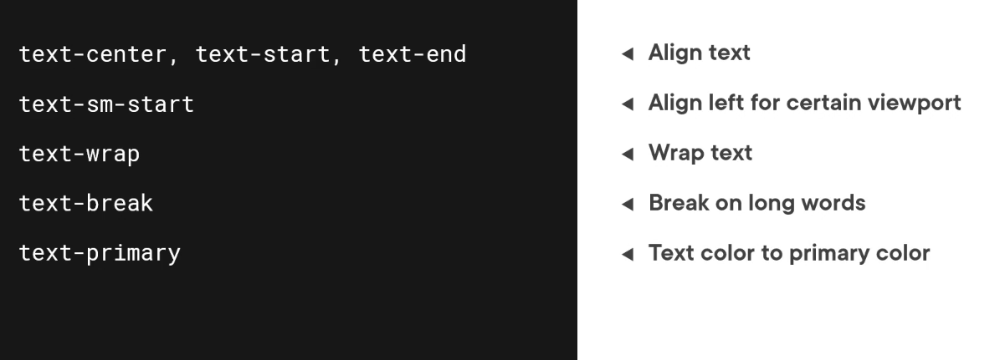
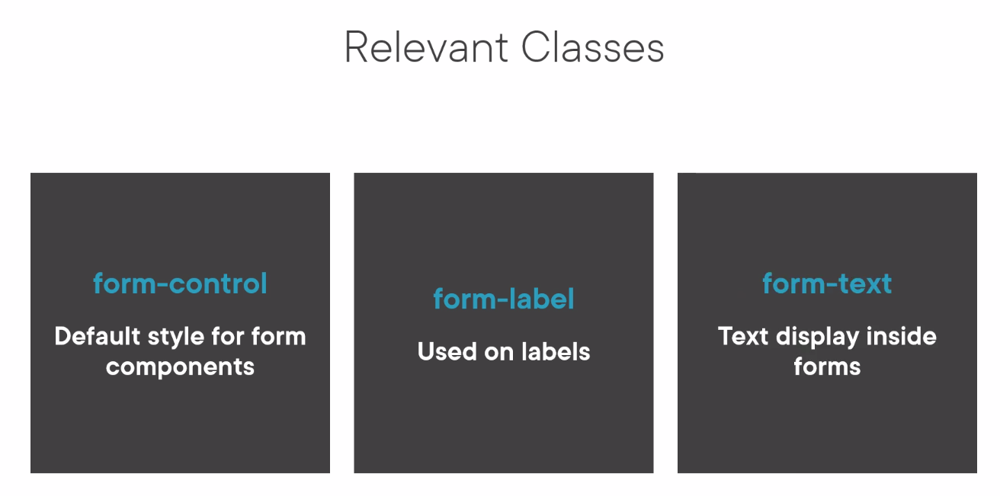

# Bootstrap

Bootstrap is a very popular open source CSS framework that can be used to build the responsive Mobile phone, tablet and website pages.

The following are the building blocks of Bootstrap

1) Layout
2) Components
3) Interactivity
4) Style Utilities
5) Theaming support

Bootstrap is supported on All major browsers. The Layest and stable releases on all platforms.

userful website for bootstrap https://getbootstrap.com/

https://getbootstrap.com/docs/5.3/examples/ is very useful to get the predefined layouts and usable components

Bootstrap Grid Concept consists of

a) Container : All the content that we use on the page will be placed inside the container. A page useually have one container but we can can multiple as well if we need. Container is used to initiate the grid system.
b) Rows and columns : Inside the container we will place one or more rows. Place elements inside the rows apply classes. Basically we will apply to put the elements in a column with in a row.
c) Breakpoints: Are the page widths that are known to the bootstrap. Based on the widht a different arrangement will be applied to the bootstrap. Breakpoints are already defined. We can customize them but they
are often not necessary. These are based on media queries.

Styling with Bootstrap

The following HTML element styles are enhanced slightly enhanced with Bootstrap

Components

All the information related to components are available in the bootstrap documentation. This informaiton is verfy useful. https://getbootstrap.com/docs/5.3/components/

   

